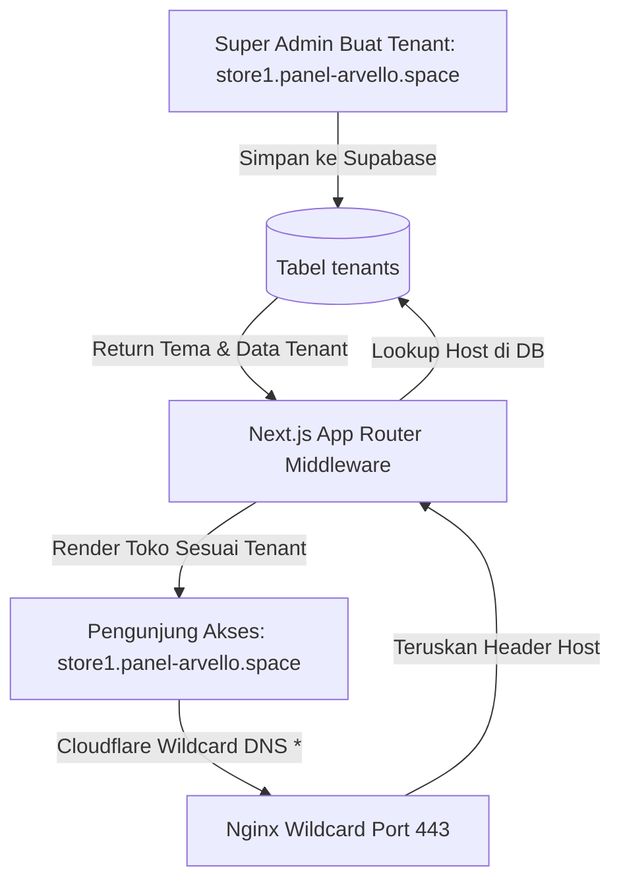
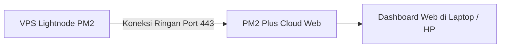

# 🌐 Panduan Lengkap: Otomatisasi Multi-Tenant Auto-SSL & Dashboard Live Logging (Vercel-Like)

Dokumen ini membahas secara mendalam dan terstruktur mengenai implementasi **Eksekusi 2 (Zero-Touch Multi-Tenant & Wildcard SSL)** dan **Eksekusi 3 (Live Realtime Logging & Server Monitoring)** untuk VPS Lightnode Anda.

---

## 📑 Daftar Isi
1. [Bagian 1: Otomatisasi Multi-Tenant & Auto-SSL (Zero-Touch)](#bagian-1-otomatisasi-multi-tenant--auto-ssl-zero-touch)
   - [1.1 Konsep Arsitektur: Bagaimana Tenant Baru Otomatis Aktif?](#11-konsep-arsitektur-bagaimana-tenant-baru-otomatis-aktif)
   - [1.2 Skenario A: Subdomain Tenant (*.domain.com) - 100% Instan](#12-skenario-a-subdomain-tenant-domaincom---100-instan)
   - [1.3 Skenario B: Custom Domain Mandiri (domain-klien.com)](#13-skenario-b-custom-domain-mandiri-domain-kliencom)
   - [1.4 Konfigurasi Nginx Wildcard Universal](#14-konfigurasi-nginx-wildcard-universal)
2. [Bagian 2: Live Realtime Logging & Monitoring (Mirip Vercel)](#bagian-2-live-realtime-logging--monitoring-mirip-vercel)
   - [2.1 Pilihan 1: PM2 Plus Web Dashboard (GUI Web Resmi PM2)](#21-pilihan-1-pm2-plus-web-dashboard-gui-web-resmi-pm2)
   - [2.2 Pilihan 2: Better Stack (Logtail) - Cloud Logging & Telegram Alert](#22-pilihan-2-better-stack-logtail---cloud-logging--telegram-alert)
   - [2.3 Pilihan 3: UptimeRobot 24/7 Heartbeat Monitoring](#23-pilihan-3-uptimerobot-247-heartbeat-monitoring)
3. [Bagian 3: Panduan Praktis Langkah Demi Langkah Implementasi](#bagian-3-panduan-praktis-langkah-demi-langkah-implementasi)

---

# Bagian 1: Otomatisasi Multi-Tenant & Auto-SSL (Zero-Touch)

Masalah umum saat menambah tenant baru adalah: *Haruskah developer membuka SSH, menambah domain di Nginx, dan menjalankan Certbot ulang?*

> **Jawabannya: TIDAK PERLU!** Dengan sistem **Zero-Touch**, ketika admin membuat tenant baru di database / Super Admin, website dan SSL tenant tersebut **langsung aktif detik itu juga**.

---

### 1.1 Konsep Arsitektur: Bagaimana Tenant Baru Otomatis Aktif?



**Alur Kerja Teknis:**
1. **Di Lapisan DNS (Cloudflare)**: DNS Wildcard (`*`) menangkap semua nama subdomain secara otomatis.
2. **Di Lapisan Web Server (Nginx)**: Nginx Wildcard meneruskan request apapun ke Next.js tanpa membatasi nama subdomain.
3. **Di Lapisan Next.js (`middleware.ts`)**: Next.js membaca `req.headers.get('host')`, mencocokkannya ke database Supabase `tenants`, lalu merender tema, produk, dan logo tenant tersebut secara dinamis.

---

### 1.2 Skenario A: Subdomain Tenant (`*.yowanastore.com` / `*.panel-arvello.space`)

Ini adalah metode **paling mudah, instan, dan bebas biaya**:

#### 1. Pasang Wildcard DNS di Cloudflare
Buka DNS Cloudflare untuk domain Anda (misal `panel-arvello.space` atau `yowanastore.com`):
* **Type**: `A`
* **Name**: `*` (Bintang / Asterisk)
* **IPv4 Address**: `130.94.94.187`
* **Proxy Status**: `Proxied (Orange Cloud / ON)`

#### 2. Keuntungan Luar Biasa:
* **SSL Otomatis**: Cloudflare otomatis menerbitkan Universal Wildcard SSL untuk semua subdomain (`*.domain.com`).
* **Zero Maintenance**: Anda bisa membuat 1.000 tenant baru (misal: `toko1`, `toko2`, `vipstore`, `gamestore`) langsung dari Admin Dashboard, dan semuanya **langsung online dengan HTTPS aktif tanpa menyentuh server VPS sama sekali**.

---

### 1.3 Skenario B: Custom Domain Mandiri (Klien Memakai `toko-sendiri.com`)

Jika ada tenant yang ingin menggunakan domain mereka sendiri (bukan subdomain):

#### Opsi 1: Cloudflare for SaaS (Standar Industri E-Commerce ⭐)
Cloudflare menyediakan fitur gratis **Cloudflare for SaaS (100 Custom Hostnames Free)**:
1. Anda mendaftarkan *Custom Hostnames* di Cloudflare.
2. Tenant cukup mengarahkan CNAME `store.toko-sendiri.com` $\rightarrow$ `cname.yowanastore.com`.
3. Cloudflare otomatis menerbitkan SSL gratis untuk domain tenant tersebut di edge network.

#### Opsi 2: Nginx Catch-All + Certbot Standalone
Jika tanpa Cloudflare for SaaS, cukup jalankan 1 baris perintah di VPS saat klien mendaftarkan domain:
```bash
certbot --nginx -d toko-sendiri.com
```

---

### 1.4 Konfigurasi Nginx Wildcard Universal

Berikut konfigurasi Nginx cerdas di `/etc/nginx/sites-available/gamingstore` yang mendukung **unlimited wildcard tenant**:

```nginx
# =========================================================================
# 1. BLOCK STAGING (Mendukung Unlimited Subdomain *.panel-arvello.space)
# =========================================================================
server {
    listen 80;
    listen [::]:80;
    server_name panel-arvello.space *.panel-arvello.space;

    client_max_body_size 20M;
    gzip on;
    gzip_proxied any;
    gzip_types text/plain text/css application/json application/javascript text/xml image/svg+xml;

    location /_next/static/ {
        alias /var/www/gamingstore-staging/.next/standalone/.next/static/;
        expires 365d;
        access_log off;
    }

    location /public/ {
        alias /var/www/gamingstore-staging/.next/standalone/public/;
        expires 30d;
        access_log off;
    }

    location / {
        proxy_pass http://127.0.0.1:3001; # Port Staging
        proxy_http_version 1.1;
        proxy_set_header Upgrade $http_upgrade;
        proxy_set_header Connection 'upgrade';
        proxy_set_header Host $host; # Sangat penting untuk multi-tenant
        proxy_set_header X-Real-IP $remote_addr;
        proxy_set_header X-Forwarded-For $proxy_add_x_forwarded_for;
        proxy_set_header X-Forwarded-Proto $scheme;
        proxy_cache_bypass $http_upgrade;
    }
}

# =========================================================================
# 2. BLOCK PRODUCTION (Mendukung Unlimited Subdomain Tenant Production)
# =========================================================================
server {
    listen 80;
    listen [::]:80;
    server_name 
        yowanastore.com 
        *.yowanastore.com 
        topupdisiniyuk.com 
        *.topupdisiniyuk.com 
        newgamingstore.com
        *.newgamingstore.com;

    client_max_body_size 20M;
    gzip on;
    gzip_proxied any;
    gzip_types text/plain text/css application/json application/javascript text/xml image/svg+xml;

    location /_next/static/ {
        alias /var/www/gamingstore/.next/standalone/.next/static/;
        expires 365d;
        access_log off;
    }

    location /public/ {
        alias /var/www/gamingstore/.next/standalone/public/;
        expires 30d;
        access_log off;
    }

    location / {
        proxy_pass http://127.0.0.1:3000; # Port Production
        proxy_http_version 1.1;
        proxy_set_header Upgrade $http_upgrade;
        proxy_set_header Connection 'upgrade';
        proxy_set_header Host $host;
        proxy_set_header X-Real-IP $remote_addr;
        proxy_set_header X-Forwarded-For $proxy_add_x_forwarded_for;
        proxy_set_header X-Forwarded-Proto $scheme;
        proxy_cache_bypass $http_upgrade;
    }
}
```

---

# Bagian 2: Live Realtime Logging & Monitoring (Mirip Vercel)

Di Vercel, kita menyukai fitur:
- Realtime Runtime Logs (melihat error server saat itu juga).
- Grafik performa CPU, Memory, dan Response Time.
- Notifikasi jika aplikasi crash atau ada error kritis.

Kita bisa mendapatkan fitur ini **bahkan lebih canggih dan gratis** di VPS melalui 2 solusi berikut:

---

### 2.1 Pilihan 1: PM2 Plus Web Dashboard (GUI Web Resmi PM2) ⭐

PM2 menyediakan dashboard berbasis browser di **`https://app.pm2.io`** (Gratis untuk monitoring server).



#### Fitur Utama PM2 Plus:
1. **Live Log Stream**: Membaca log `console.log` dan `console.error` secara realtime dari browser.
2. **CPU & Memory Live Graph**: Melihat pemakaian RAM Staging vs Prod secara visual.
3. **Tombol Remote Control**: Anda bisa menekan tombol **Restart / Reload / Stop** langsung dari web tanpa membuka terminal SSH!
4. **Exception Alert**: Notifikasi instan ke email jika aplikasi mengalami *uncaught exception* / crash.

---

### 2.2 Pilihan 2: Better Stack (Logtail) - Cloud Logging & Telegram Alert 🏆

Jika Anda ingin tampilan logging modern yang **persis seperti Vercel Log Inspector**, gunakan **Better Stack (Logtail)** (Free 1 GB Log/bulan).

#### Kelebihan Better Stack:
1. **Fitur Search & Filter Canggih**:
   - Cari log berdasarkan kata kunci (misal: `ORDER_FAILED`, `PAYMENT_CALLBACK`, `IDR`, `MYR`).
   - Filter log per nama tenant tertentu.
2. **Notifikasi Error ke Telegram / Discord**:
   - Jika ada transaksi pembayaran yang gagal atau API pihak ketiga (Tripay/Midtrans/VIP Reseller) error, bot akan langsung mengirim pesan peringatan ke grup **Telegram / Discord** Anda lengkap dengan stack trace error-nya.

---

### 2.3 Pilihan 3: UptimeRobot 24/7 Heartbeat Monitoring

* **Fungsi**: Memastikan website selalu online 24 jam sehari.
* **Cara Kerja**: Mengecek URL toko Anda (misal `https://games.panel-arvello.space`) setiap 60 detik.
* **Notifikasi**: Jika ada gangguan jaringan atau server down, Anda langsung menerima notifikasi WhatsApp / Email / Telegram dalam hitungan detik.

---

# Bagian 3: Panduan Praktis Langkah Demi Langkah Implementasi

Berikut adalah panduan eksekusi cepat untuk mengaktifkan fitur-fitur di atas:

---

### 🚀 A. Mengaktifkan PM2 Plus Web Dashboard (Hanya 2 Menit)

1. Buka website **[https://app.pm2.io](https://app.pm2.io)** dan buat akun gratis.
2. Klik tombol **"Create Bucket"** (beri nama misal: `Gaming Store VPS`).
3. PM2 akan memberikan perintah 1 baris seperti ini:
   ```bash
   pm2 link [SECRET_KEY] [PUBLIC_KEY]
   ```
4. Buka terminal VPS Anda, lalu tempel perintah tersebut.
5. **Selesai!** Dashboard web Anda di `app.pm2.io` akan langsung menampilkan grafik RAM, CPU, dan Live Log kedua aplikasi (Staging & Prod)! 🎉

---

### 🚀 B. Setup Notifikasi Alert Telegram via PM2 (Opsional)

Jika ingin server otomatis mengirim pesan ke Telegram saat ada crash:
```bash
# Install modul notifikasi PM2 Telegram
pm2 install pm2-telegram-notification

# Set Bot Token & Chat ID Telegram Anda
pm2 set pm2-telegram-notification:bot_token "TOKEN_BOT_TELEGRAM_ANDA"
pm2 set pm2-telegram-notification:chats "CHAT_ID_ANDA"
pm2 set pm2-telegram-notification:error_only true
```

---

### 🚀 C. Mengaktifkan Uptime Monitoring Gratis

1. Buka **[https://uptimerobot.com](https://uptimerobot.com)** (Free Tier 50 Monitors).
2. Tambahkan monitor baru:
   - **Monitor Type**: `HTTPS`
   - **Friendly Name**: `Staging Storefront`
   - **URL**: `https://games.panel-arvello.space`
   - **Monitoring Interval**: `1 minute`
3. Tambahkan monitor untuk Production:
   - **URL**: `https://yowanastore.com` (atau domain prod Anda).

---

## 🎯 Rangkuman Manfaat Sistem Ini

| Kebutuhan | Solusi yang Diterapkan | Hasil untuk Anda |
| :--- | :--- | :--- |
| **Tambah Tenant Baru** | Wildcard DNS + Nginx Wildcard | **0 Detik**, langsung aktif tanpa sentuh terminal VPS. |
| **Lihat Log & Error Realtime** | PM2 Plus Web GUI (`app.pm2.io`) | Bisa memantau log & CPU/RAM dari browser laptop/HP. |
| **Notifikasi Gangguan Transaksi** | PM2 Telegram Alert / Better Stack | Notifikasi instan ke HP jika ada error API atau server down. |
| **Deployment Code Baru** | GitHub Actions CI/CD | Cukup `git push`, server otomatis update dengan zero-downtime. |
